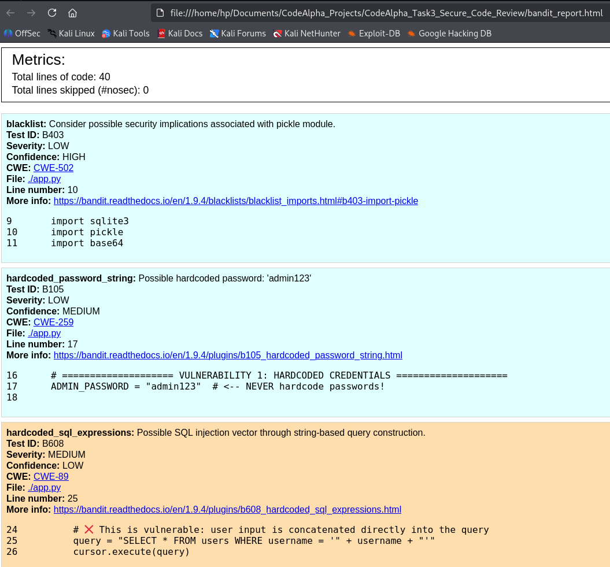
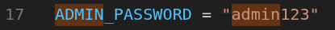
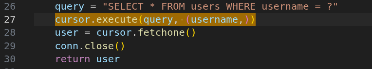
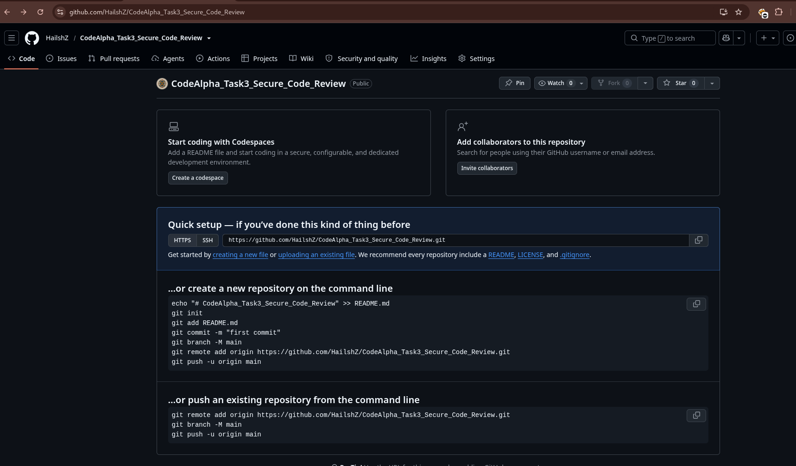

# CodeAlpha Task 3: Secure Code Review

## 📡 Overview
A secure code review project for CodeAlpha Internship Task 3. This repository contains a deliberately vulnerable Flask application (`app.py`) and its secure version (`app_fixed.py`). The project demonstrates the identification, documentation, and remediation of common security vulnerabilities.

## 🎯 What This Project Covers
- **Vulnerability Identification:** Manual code review and static analysis (Bandit).
- **Vulnerability Categories:** SQL Injection, XSS, Hardcoded Credentials, Insecure Deserialization, Debug Mode.
- **Remediation:** Parameterized queries, output escaping, JSON over pickle, environment variables.

## 🛠️ Tools Used
- **Python 3** – Application language.
- **Flask** – Web framework.
- **Bandit** – Static Application Security Testing (SAST) tool.

## 🚀 How to Run

### 1. Clone and Setup
```bash
git clone https://github.com/HailshZ/CodeAlpha_Task3_Secure_Code_Review.git
cd CodeAlpha_Task3_Secure_Code_Review
python3 -m venv venv
source venv/bin/activate  # On Windows: venv\Scripts\activate
```

### 2. Install Dependencies
```bash
pip install -r requirements.txt
```

### 3. Run Applications
- To run the vulnerable app: `python app.py`
- To run the secure app: `python app_fixed.py`

## 📸 Screenshots

### Figure 1: Bandit SAST Scan Results


### Figure 2: Manual Review – Hardcoded Credentials


### Figure 3: Remediation – Parameterized Query


### Figure 4: GitHub Repository

